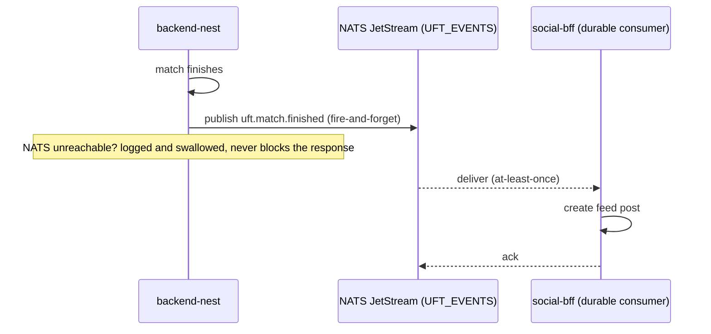

<Callout type="problem">
The social feed (posts, follows, player activity) is a separate service (`social-bff`) from the core tournament backend, and it shouldn't be able to slow down or break match scoring, registrations, or tournament automation — but it still needs to know when a match finishes or a player registers, reliably, not just "usually."
</Callout>

<Callout type="solution">
A direct HTTP call from the backend to `social-bff` on every relevant action would couple the two services' uptime together, so I used NATS JetStream instead — chosen specifically over plain NATS because `social-bff` needs at-least-once delivery with replay, which plain pub/sub doesn't give you. One JetStream stream (`UFT_EVENTS`), subject convention `uft.<domain>.<event>`, 7-day retention. `backend-nest` publishes fire-and-forget: every publish call is wrapped so that if NATS is unreachable, it's logged and swallowed — a NATS outage must never break the request that triggered it. `social-bff` consumes through a durable, named JetStream consumer with explicit ack/nak, so it picks up exactly where it left off after a restart.
</Callout>

<Callout type="tradeoffs">
Four event subjects are declared (match finished, player registered, tournament updated, player ranking changed), but only two are actually published anywhere in the code today. The other two are consumed on the `social-bff` side but have no publish call site yet in `backend-nest` — real evidence of designing the contract ahead of the implementation, not a hidden gap. Separately, the subject constants are duplicated by hand between the two services (no shared package), with a comment demanding manual sync — a real coupling risk a shared library would remove.
</Callout>

<Callout type="lessons">
In production, finishing a match publishes `uft.match.finished` with the two teams, scores, and category, and `social-bff` turns that into a system-authored feed post. Confirming a tournament registration publishes `uft.player.registered_tournament` once per roster player, and each becomes a personal activity post authored by that player's own account, not a generic system post. Fire-and-forget publish paired with a durable, explicitly-acked consumer is a good split for "the core product must never break because a side feature is down" — but declaring more of the event contract than you've wired up is only honest if you track which half is real, which is why this write-up says so directly. The manually-synced subject constants are the next piece of debt worth removing, ideally before a third consumer makes the sync problem worse.
</Callout>
