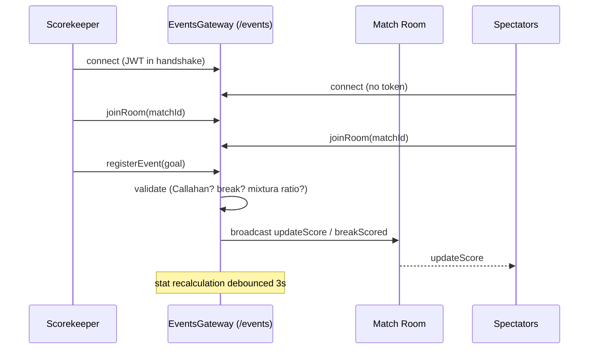

<Callout type="problem">
Live matches need every connected client — the scorekeeper, spectators, live statistics — converging on the same state immediately, and the state itself isn't generic: a goal can only be scored by the attacking team unless it's a Callahan (a defense-only score), a "break" depends on whether the team that scored is the same team that pulled, and mixed-gender divisions have gender-ratio rules that change based on the parity of the goal count. This has to hold under bursts of events during fast play, not just one update at a time.
</Callout>

<Callout type="solution">
Socket.io over two namespaces (`/events` for live matches, `/notifications` for everything else), with the Ultimate-specific rules enforced directly in the gateway layer as events arrive: possession tracking, break detection (comparing who scored to who pulled), Callahan validation, and mixed-division gender-ratio warnings on odd goal counts. Statistics aren't recalculated on every single event — recalculation is debounced by 3 seconds so a burst of scoring plays doesn't trigger a recompute per event. Editing or deleting an event is restricted to the last one registered, and doing so explicitly reverts possession/score/mixtura state rather than replaying the whole match history. Authentication is optional to connect (spectators can watch without a token) but required for any action that changes state.
</Callout>

<Callout type="tradeoffs">
Keeping this logic in the gateway made it fast to build and iterate on while the rules were still being nailed down, at the cost of a very large file — it grew to roughly 3,200 lines before being partially split into `rooms/`, `state/`, and `timer/` service+store pairs, each independently unit-tested. The last-event-only edit/delete rule keeps state reconciliation simple and avoids building a full undo history, but it means correcting an older mistake mid-match isn't supported — a real, accepted limitation rather than an oversight.
</Callout>

<Callout type="lessons">
The websocket layer has 83 tests at 90%+ coverage on critical paths, including dedicated concurrency tests — 100+ spectators in the same room, 10+ simultaneous matches with verified room isolation, mass disconnects, fast reconnection — all passing. A hand-written load test (using the real `socket.io-client`, not a generic tool) measured 100% connection/join success with 0 errors, but average connection time around 3.9 seconds — which, against the team's own benchmark (under 500ms), is honestly rated "high," not "done." An earlier load-testing attempt with a generic tool had connected to the wrong Socket.io namespace and produced a false "this is broken" signal — the fix was testing with the real client library instead of trusting a general-purpose tool. Correctness was validated before latency was, which is defensible, but it leaves a real gap between "works" and "fast" that's now on the list: reviewing indexes on the `joinRoom` path and pacing connection batches more conservatively.
</Callout>
