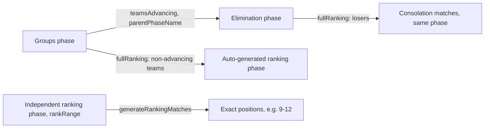

<Callout type="problem">
Tournaments don't all use the same format. Round robin (2–8 teams), single elimination (8/16/32 teams), and groups-into-elimination (9–15 or 17+ teams, with configurable group sizes and advancing counts) all need different bracket generation and standings math — and organizers also wanted custom formats: split brackets by rank range, and separate "ranking phases" to determine exact placements for teams that don't make the main bracket.
</Callout>

<Callout type="solution">
Rather than hardcoding a fixed set of formats and adding new code for every new tournament shape, phases became data: each phase has an `order`, an optional `teamsAdvancing`, a `parentPhaseName` (must match an earlier phase's name exactly, which defines the pipeline), an optional `rankRange` (e.g. `"9-15"`) for split/independent brackets, and a `fullRanking` flag with two distinct behaviors depending on whether it's attached to a groups phase or an elimination phase. Before refactoring any of the surrounding frontend code, I wrote characterization tests against the actual propagation logic covering black-box cases: a 4-team bracket, an 8-team bracket, a bracket with a bye, and a bracket with a walkover — the tests describe what the system already does, so a refactor that changes the numbers gets caught immediately.
</Callout>

<Callout type="tradeoffs">
A configurable phase graph is much more flexible than hardcoded formats, but the flexibility has real footguns that show up in the documentation itself: parent-phase linking requires an exact name match (a typo silently breaks the pipeline instead of erroring loudly at the point of the typo), and `fullRanking` means two different things depending on context — a distinction that's easy to get wrong without the guide open next to you.
</Callout>

<Callout type="lessons">
The format math checks out against worked examples: round robin for 6 teams produces 15 matches (n(n-1)/2); single elimination for 16 teams produces 15 matches across quarterfinals/semis/final; a 12-team groups-into-elimination example (3 groups of 4, top 2 advancing) produces 18 group matches feeding a 6-team knockout. During an unrelated frontend refactor, the standings model's own characterization tests (19 of them) caught a real deduplication bug: matches were being deduped by `matchId || tempId || home-away-phase`, and matches missing those fields could collide on the fallback key and get silently dropped from the standings view. It wasn't found by inspection — it was found because a test suite existed to compare against, which is the actual lesson here. The exact-name-match requirement for phase linking is a known rough edge; documentation (a dedicated FAQ and common-errors section) is the current mitigation, not a code fix — an honest trade-off, not a finished one.
</Callout>
