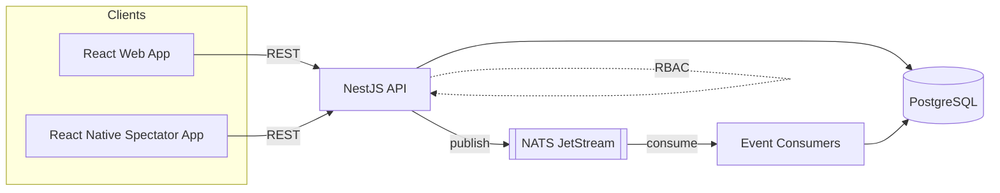
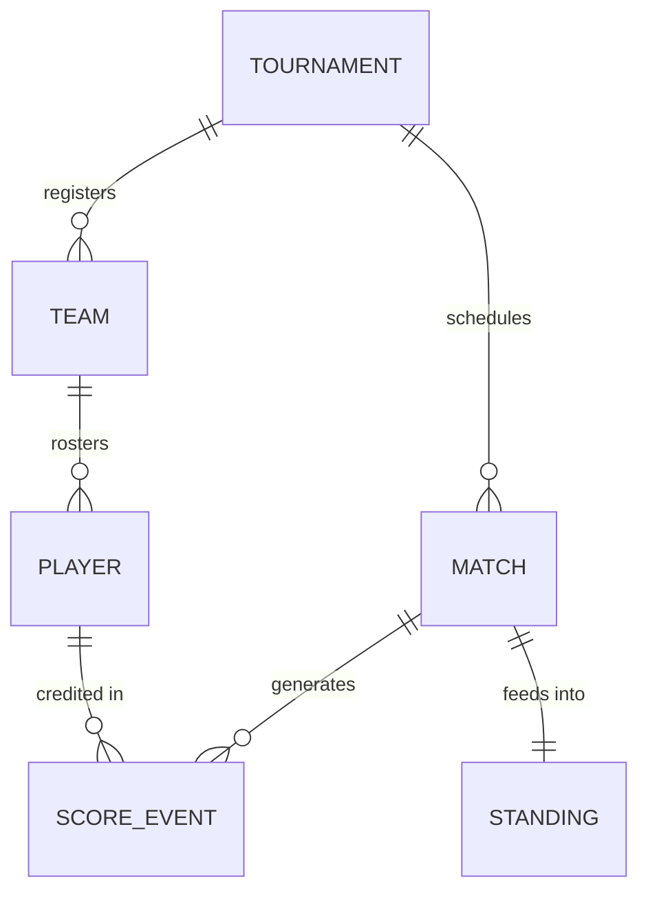
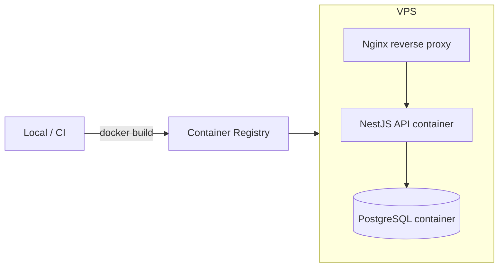

This page is a reference, not a narrative — it's how I'd walk a Staff Engineer through the system on a whiteboard. For the story behind specific decisions, see the [Case Studies](/case-studies) section; for the product framing, see [UFT](/uft).

## System architecture

At a high level, UFT is a single NestJS API backed by PostgreSQL, with NATS JetStream as the event backbone between the parts of the system that need to react to state changes (score updates, standings recalculation) without the request path waiting on them.

## Backend architecture

The API is a NestJS application organized around the domain modules the platform actually has — tournaments, registrations, matches, scoring, and statistics — each exposing a REST surface and owning its own PostgreSQL tables. NestJS's module/provider structure keeps each domain's business logic separate from HTTP concerns, which matters once scoring logic and statistics computation both need to react to the same underlying events.

## Event-driven architecture

Score updates and other state changes that affect more than one downstream consumer (live statistics, standings, spectator views) go through NATS JetStream rather than being computed synchronously inside the request that created them. That decouples "record what happened" from "recompute everything that depends on it" — the second part can be slower, retried, or scaled independently of the API's request/response path.

*The specific event types, consumer groups, and delivery guarantees in use are documented in detail in the [Case Studies](/case-studies) section.*

## Database design

PostgreSQL holds 49 entities in production. Simplified, the core of the domain looks like this:

*Illustrative — 6 of the 49 production entities, shown to convey the shape of the domain rather than the literal schema.*

## Realtime system

Scorekeeping and live statistics need every connected client looking at a match to converge on the same state quickly, including when multiple scorekeepers or devices touch the same match. The event-driven layer above is what makes that convergence possible without every client polling the API directly.

## Security

Access control is role-based (RBAC). Roles determine what a user can do within a tournament — who can record scores, who can manage registrations, who can administer the platform itself. The specific role model and what was hard about it are covered in the RBAC case study.

## Deployment

## Infrastructure

The platform runs as Docker containers on a DigitalOcean VPS, behind Nginx as a reverse proxy handling TLS termination and routing. This is deliberately simple infrastructure for the traffic UFT sees today — the trade-offs of that choice, and what would change first under more load, are covered in [Scaling realtime spectators](/case-studies/scaling-realtime-spectators).
