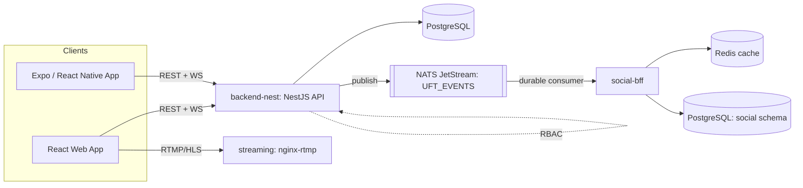
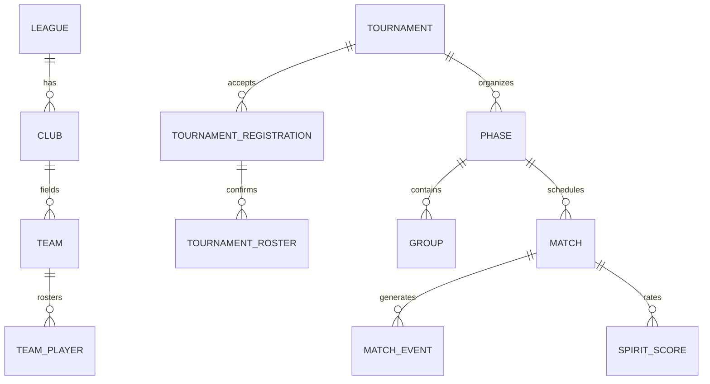
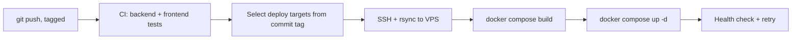

This page is a reference, not a narrative — it's how I'd walk a Staff Engineer through the system on a whiteboard. For the story behind specific decisions, see the [Case Studies](/case-studies) section; for the product framing, see [UFT](/uft).

## System architecture

UFT isn't one service — it's a small system. A NestJS API (`backend-nest`, 32 feature modules) owns the core domain: tournaments, matches, RBAC, statistics. A separate NestJS microservice (`social-bff`) owns the social feed (posts, follows, player profiles) with its own Postgres schema and a Redis cache. The two are connected by NATS JetStream rather than direct calls, so the social feed can be down without affecting live scorekeeping. A third piece (`streaming`, nginx-rtmp) handles live video for spectators. Three clients consume this: a React/Vite web app, an Expo/React Native mobile app (used in the field by scorekeepers, with offline support, plus role-specific dashboards for coaches, club admins, and league presidents), and the public web frontend.

## Backend architecture

`backend-nest` has 32 feature modules — auth, RBAC, league/club/team/player, tournaments, tournament-automation, match, statistics, spirit (Ultimate's sportsmanship scoring), streaming, notifications, and more — each following the same layout (`controllers/ services/ entities/ dto/`). Some modules carry real complexity: `websockets/` was refactored out of a single ~3,200-line gateway into `rooms/`, `state/`, and `timer/` service+store pairs, each independently unit-tested, to make the realtime logic testable without spinning up a full socket connection.

## Event-driven architecture

Two things need to happen when a match finishes or a player registers: the core write (record the score, confirm the registration) and a side effect that shouldn't block it (post to the social feed). Those go through NATS JetStream on a single stream (`UFT_EVENTS`, subjects `uft.match.finished`, `uft.player.registered_tournament`, `uft.tournament.updated`, `uft.player.ranking_changed`), with `backend-nest` publishing fire-and-forget — a NATS outage is caught and logged, never allowed to break the request that triggered it — and `social-bff` consuming through a durable, explicitly-acked JetStream consumer, so it doesn't lose events if it's briefly down. The full reasoning, and what's actually wired versus just declared, is in [Event-driven architecture using NATS](/case-studies/event-driven-architecture-nats).

## Database design

Across `backend-nest` and `social-bff`, the schema spans 49 entities in production. The core tournament domain looks like this, simplified:

*Simplified — the domain hierarchy (Federation → League → Club → Team → Player) and phase-configuration system (round robin, single elimination, groups + elimination, custom ranking brackets) add real structure on top of this core.*

## Realtime system

Scorekeeping runs over Socket.io, namespaced `/events` (live matches) and `/notifications`. The gateway enforces Ultimate-specific rules as events come in — a goal can only be scored by the attacking team unless it's a Callahan (defense-only), break detection compares who scored to who pulled, and mixed-division games get gender-ratio warnings on odd-numbered goals. Stat recalculation is debounced (3 seconds) so a burst of events doesn't trigger a recompute per event. Editing or deleting is restricted to the last event registered, which keeps state reconciliation simple at the cost of not supporting arbitrary undo. Full detail in [Designing realtime scorekeeping](/case-studies/realtime-scorekeeping).

## Security

Access control is role-based across 13 role-scoped portals, enforced by a guard that checks both `@Roles` and `@RequirePermissions` metadata — absence of a required check never grants access. Because roles were seeded inconsistently across two different seeders early on, an explicit alias table maps role-name variants to a canonical name (never merging roles of different privilege levels). A July 2026 security review found and fixed a handful of real issues, including an admin privilege-escalation path (now blocked, with a regression test) and IDOR on several file-upload endpoints (now validated against the authenticated user, with 11 regression tests) — two upload endpoints are still explicitly tracked as open residual risk rather than quietly ignored. Full story in [RBAC implementation](/case-studies/rbac-implementation).

## Deployment

CI/CD runs through GitHub Actions: every push runs backend and frontend test suites, and deploys are gated on both passing. Production deploys are selective — a commit message tag (`[frontend]`, `[backend-nest]`, `[both]`) or a manual dispatch decides what actually redeploys, over SSH/rsync/Docker Compose to a single DigitalOcean VPS that runs staging and production side by side on separate ports and networks.

I measured this pipeline rather than assumed it was fine: a self-authored analysis found deploys were taking 20–45 minutes, mostly from rebuilding the frontend without any build cache on every single deploy. The fix list (stop wiping Docker's build cache pre-deploy, stop forcing a cache-less frontend rebuild) is written up but not fully applied yet — that's real, ongoing infrastructure work, not a solved problem.

## Infrastructure

Docker Compose runs Postgres, `backend-nest`, NATS (JetStream-enabled), Redis, `social-bff`, the streaming service, and an automated nightly Postgres backup job (7-day retention) — all on one VPS. The platform was migrated from an older, disk-constrained droplet to a fresh one with about 3 minutes of DNS-cutover downtime. What this setup can't yet absorb, and what I'm actually measuring about that, is in [Scaling realtime spectators](/case-studies/scaling-realtime-spectators).
