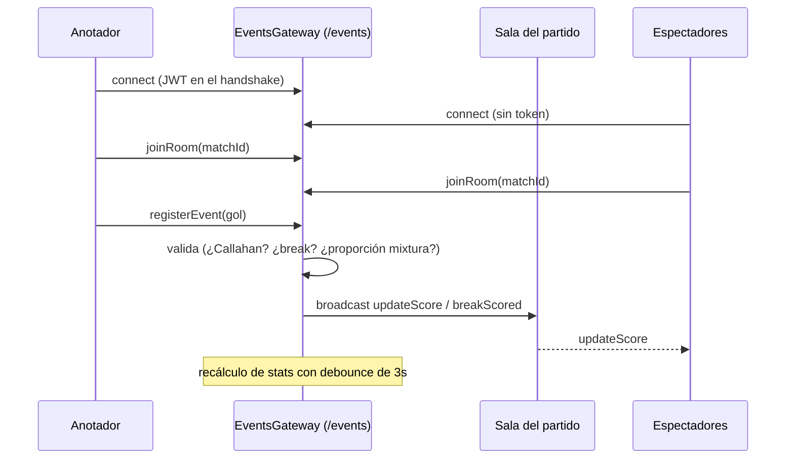

<Callout type="problem">
Los partidos en vivo necesitan que cada cliente conectado — el anotador, los espectadores, las estadísticas en vivo — converja al mismo estado de inmediato, y ese estado no es genérico: un gol solo lo puede anotar el equipo que ataca a menos que sea un Callahan (un punto exclusivo de la defensa), un "break" depende de si el equipo que anotó es el mismo que hizo el pull, y las divisiones mixtas tienen reglas de proporción de género que cambian según la paridad del conteo de goles. Esto tiene que sostenerse bajo ráfagas de eventos durante juego rápido, no solo una actualización a la vez.
</Callout>

<Callout type="solution">
Socket.io sobre dos namespaces (`/events` para partidos en vivo, `/notifications` para todo lo demás), con las reglas propias de Ultimate impuestas directamente en la capa de gateway a medida que llegan los eventos: seguimiento de posesión, detección de break (comparando quién anotó contra quién hizo el pull), validación de Callahan, y advertencias de proporción de género en división mixta en conteos de goles impares. Las estadísticas no se recalculan en cada evento individual — el recálculo tiene debounce de 3 segundos para que una ráfaga de jugadas no dispare un recálculo por evento. Editar o eliminar un evento está restringido al último registrado, y hacerlo revierte explícitamente el estado de posesión/puntaje/mixtura en vez de reproducir todo el historial del partido. La autenticación es opcional para conectarse pero requerida para cualquier acción que cambie el estado.
</Callout>

<Callout type="tradeoffs">
Mantener esta lógica en el gateway lo hizo rápido de construir e iterar mientras las reglas todavía se estaban definiendo, a costa de un archivo muy grande — creció a cerca de 3,200 líneas antes de dividirse parcialmente en pares servicio+store en `rooms/`, `state/` y `timer/`, cada uno con tests unitarios independientes. La regla de editar/eliminar solo el último evento mantiene simple la reconciliación de estado y evita construir un historial de deshacer completo, pero significa que corregir un error anterior a mitad de partido no está soportado — una limitación real y aceptada, no un descuido.
</Callout>

<Callout type="lessons">
La capa de websockets tiene 83 tests con más de 90% de cobertura en rutas críticas, incluyendo tests de concurrencia dedicados — 100+ espectadores en la misma sala, 10+ partidos simultáneos con aislamiento de sala verificado, desconexiones masivas, reconexión rápida — todos pasando. Un test de carga escrito a mano (usando el `socket.io-client` real, no una herramienta genérica) midió 100% de éxito en conexión/unión con 0 errores, pero un tiempo promedio de conexión de cerca de 3.9 segundos — que, contra el benchmark propio del equipo (menos de 500ms), se califica honestamente como "alto", no "resuelto". Un intento anterior de test de carga con una herramienta genérica se había conectado al namespace equivocado de Socket.io y produjo una señal falsa de "esto está roto" — el arreglo fue probar con la librería cliente real en vez de confiar en una herramienta de propósito general. La corrección se validó antes que la latencia, lo cual es defendible, pero deja una brecha real entre "funciona" y "es rápido" que ya está en la lista: revisar índices en el camino de `joinRoom` y espaciar los lotes de conexión de forma más conservadora.
</Callout>
