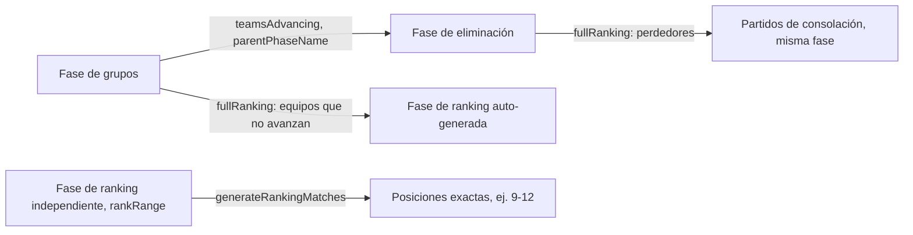

<Callout type="problem">
No todos los torneos usan el mismo formato. Round robin (2–8 equipos), eliminación simple (8/16/32 equipos), y grupos hacia eliminación (9–15 o 17+ equipos, con tamaños de grupo y cantidades de avance configurables) necesitan matemática distinta de generación de bracket y posiciones — y los organizadores además pedían formatos personalizados: brackets divididos por rango de ranking, y "fases de ranking" separadas para determinar posiciones exactas de equipos que no llegan al bracket principal.
</Callout>

<Callout type="solution">
En vez de codificar un conjunto fijo de formatos y agregar código nuevo por cada forma de torneo nueva, las fases se volvieron datos: cada fase tiene un `order`, un `teamsAdvancing` opcional, un `parentPhaseName` (debe coincidir exactamente con el nombre de una fase anterior, lo que define el pipeline), un `rankRange` opcional para brackets divididos/independientes, y un flag `fullRanking` con dos comportamientos distintos según si está asociado a una fase de grupos o de eliminación. Antes de refactorizar el código de frontend alrededor, escribí tests de caracterización contra la lógica real de propagación cubriendo casos de caja negra: un bracket de 4 equipos, uno de 8, uno con bye, y uno con walkover — los tests describen lo que el sistema ya hace, así que un refactor que cambie los números se detecta de inmediato.
</Callout>

<Callout type="tradeoffs">
Un grafo de fases configurable es mucho más flexible que formatos fijos, pero la flexibilidad tiene trampas reales que aparecen en la propia documentación: el enlace de fase padre requiere coincidencia exacta de nombre (un typo rompe silenciosamente el pipeline en vez de fallar ruidosamente en el punto del typo), y `fullRanking` significa dos cosas distintas según el contexto — una distinción fácil de confundir sin la guía abierta al lado.
</Callout>

<Callout type="lessons">
La matemática de formato cuadra contra ejemplos trabajados: round robin para 6 equipos produce 15 partidos (n(n-1)/2); eliminación simple para 16 equipos produce 15 partidos entre cuartos/semis/final; un ejemplo de 12 equipos en grupos hacia eliminación (3 grupos de 4, top 2 avanzan) produce 18 partidos de grupo que alimentan un knockout de 6 equipos. Durante un refactor de frontend no relacionado, los propios tests de caracterización del modelo de posiciones (19 de ellos) detectaron un bug real de deduplicación: los partidos se deduplicaban por `matchId || tempId || home-away-phase`, y los partidos sin esos campos podían colisionar en la clave de respaldo y ser eliminados silenciosamente de la vista de posiciones. No se encontró por inspección — se encontró porque existía una suite de tests contra la cual comparar, que es la lección real acá. El requisito de coincidencia exacta de nombre para enlazar fases es una arista conocida; la documentación es la mitigación actual, no un arreglo de código — un trade-off honesto, no uno terminado.
</Callout>
