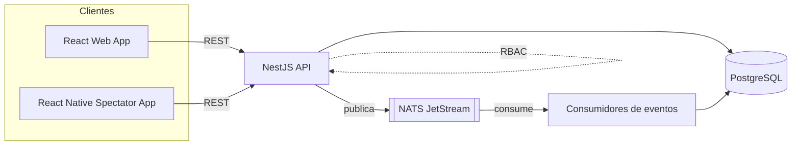
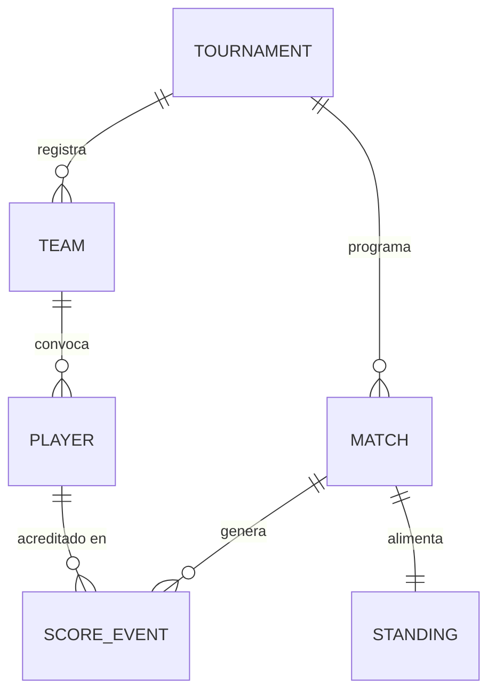
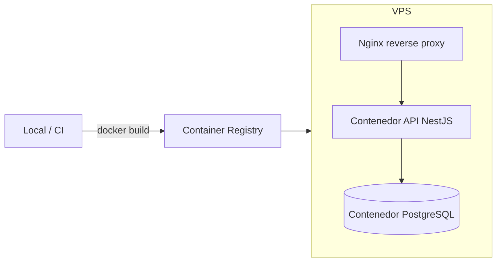

Esta página es una referencia, no una narrativa — es como le explicaría el sistema a un Staff Engineer en un whiteboard. Para la historia detrás de decisiones puntuales, ver la sección de [Case Studies](/case-studies); para el enfoque de producto, ver [UFT](/uft).

## Arquitectura del sistema

A alto nivel, UFT es una única API en NestJS respaldada por PostgreSQL, con NATS JetStream como columna vertebral de eventos entre las partes del sistema que necesitan reaccionar a cambios de estado (actualizaciones de puntaje, recálculo de posiciones) sin que el request principal tenga que esperarlas.

## Arquitectura backend

La API es una aplicación NestJS organizada alrededor de los módulos de dominio que la plataforma realmente tiene — torneos, inscripciones, partidos, puntajes y estadísticas — cada uno exponiendo su propia superficie REST y siendo dueño de sus tablas en PostgreSQL. La estructura de módulos/providers de NestJS mantiene separada la lógica de negocio de cada dominio de las preocupaciones HTTP, algo que importa cuando la lógica de puntaje y el cálculo de estadísticas necesitan reaccionar a los mismos eventos.

## Arquitectura orientada a eventos

Las actualizaciones de puntaje y otros cambios de estado que afectan a más de un consumidor downstream (estadísticas en vivo, posiciones, vistas de espectadores) pasan por NATS JetStream en lugar de calcularse de forma síncrona dentro del request que los origina. Eso desacopla "registrar lo que pasó" de "recalcular todo lo que depende de eso" — esto último puede ser más lento, reintentarse, o escalar de forma independiente al camino request/response de la API.

*Los tipos de evento específicos, grupos de consumidores y garantías de entrega en uso están documentados en detalle en la sección de [Case Studies](/case-studies).*

## Diseño de base de datos

PostgreSQL contiene 49 entidades en producción. Simplificado, el núcleo del dominio se ve así:

*Ilustrativo — 6 de las 49 entidades en producción, mostradas para transmitir la forma del dominio, no el esquema literal.*

## Sistema en tiempo real

El scorekeeping y las estadísticas en vivo necesitan que cada cliente conectado a un partido converja rápido al mismo estado, incluso cuando varios anotadores o dispositivos tocan el mismo partido. La capa orientada a eventos descrita arriba es lo que hace posible esa convergencia sin que cada cliente tenga que hacer polling directo a la API.

## Seguridad

El control de acceso es basado en roles (RBAC). Los roles determinan qué puede hacer un usuario dentro de un torneo — quién puede registrar puntajes, quién puede administrar inscripciones, quién puede administrar la plataforma misma. El modelo de roles específico y qué fue difícil de resolver ahí se cubre en el case study de RBAC.

## Despliegue

## Infraestructura

La plataforma corre como contenedores Docker en un VPS de DigitalOcean, detrás de Nginx como reverse proxy que maneja la terminación TLS y el enrutamiento. Es infraestructura deliberadamente simple para el tráfico que UFT tiene hoy — los trade-offs de esa elección, y qué cambiaría primero con más carga, se cubren en [Escalando espectadores en tiempo real](/case-studies/scaling-realtime-spectators).
