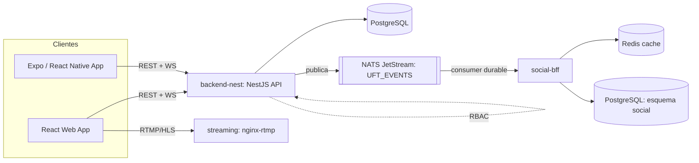
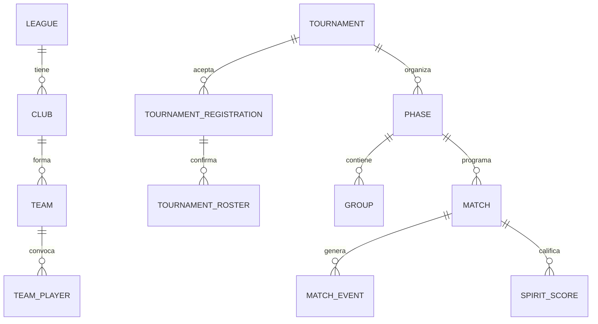
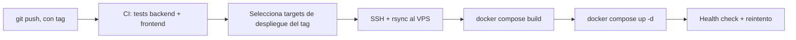

Esta página es una referencia, no una narrativa — es como le explicaría el sistema a un Staff Engineer en un whiteboard. Para la historia detrás de decisiones puntuales, ver la sección de [Case Studies](/case-studies); para el enfoque de producto, ver [UFT](/uft).

## Arquitectura del sistema

UFT no es un solo servicio — es un pequeño sistema. Una API en NestJS (`backend-nest`, 32 módulos de dominio) es dueña del dominio principal: torneos, partidos, RBAC, estadísticas. Un microservicio NestJS separado (`social-bff`) es dueño del feed social (posts, follows, perfiles de jugador) con su propio esquema de Postgres y caché en Redis. Los dos están conectados por NATS JetStream en vez de llamadas directas, así el feed social puede estar caído sin afectar el scorekeeping en vivo. Una tercera pieza (`streaming`, nginx-rtmp) maneja video en vivo para espectadores. Tres clientes consumen esto: una web app en React/Vite, una app móvil en Expo/React Native (usada en campo por los anotadores, con soporte offline, más dashboards específicos por rol para coaches, admins de club y presidentes de liga), y el frontend web público.

## Arquitectura backend

`backend-nest` tiene 32 módulos de dominio — auth, RBAC, liga/club/equipo/jugador, torneos, automatización de torneos, partidos, estadísticas, spirit (el puntaje de deportividad de Ultimate), streaming, notificaciones, y más — cada uno con la misma estructura (`controllers/ services/ entities/ dto/`). Algunos módulos cargan complejidad real: `websockets/` se refactorizó desde un único gateway de ~3,200 líneas hacia pares servicio+store en `rooms/`, `state/` y `timer/`, cada uno con tests unitarios independientes, para que la lógica de tiempo real sea testeable sin levantar una conexión de socket completa.

## Arquitectura orientada a eventos

Dos cosas necesitan pasar cuando un partido termina o un jugador se inscribe: la escritura principal (registrar el puntaje, confirmar la inscripción) y un efecto secundario que no debería bloquearla (publicar en el feed social). Eso pasa por NATS JetStream en un único stream (`UFT_EVENTS`, subjects `uft.match.finished`, `uft.player.registered_tournament`, `uft.tournament.updated`, `uft.player.ranking_changed`), con `backend-nest` publicando fire-and-forget — una caída de NATS se captura y se registra en logs, nunca se le permite romper el request que la originó — y `social-bff` consumiendo a través de un consumer durable de JetStream con ack explícito, así no pierde eventos si está caído un momento. El razonamiento completo, y qué está realmente conectado versus solo declarado, está en [Arquitectura orientada a eventos con NATS](/case-studies/event-driven-architecture-nats).

## Diseño de base de datos

Entre `backend-nest` y `social-bff`, el esquema abarca 49 entidades en producción. El núcleo del dominio de torneos se ve así, simplificado:

*Simplificado — la jerarquía de dominio (Federación → Liga → Club → Equipo → Jugador) y el sistema de configuración de fases (round robin, eliminación simple, grupos + eliminación, brackets de ranking personalizados) agregan estructura real sobre esto.*

## Sistema en tiempo real

El scorekeeping corre sobre Socket.io, con namespaces `/events` (partidos en vivo) y `/notifications`. El gateway impone las reglas propias de Ultimate a medida que llegan los eventos — un gol solo lo puede anotar el equipo que ataca a menos que sea un Callahan (solo defensa), la detección de break compara quién anotó contra quién hizo el pull, y los partidos de división mixta reciben advertencias de proporción de género en goles impares. El recálculo de estadísticas tiene debounce (3 segundos) para que una ráfaga de eventos no dispare un recálculo por cada uno. Editar o eliminar está restringido al último evento registrado, lo que mantiene simple la reconciliación de estado a costa de no soportar deshacer arbitrario. Detalle completo en [Diseñando el scorekeeping en tiempo real](/case-studies/realtime-scorekeeping).

## Seguridad

El control de acceso es basado en roles a través de 13 portales por rol, impuesto por un guard que verifica tanto metadata de `@Roles` como de `@RequirePermissions` — la ausencia de una verificación requerida nunca concede acceso. Como los roles se sembraron de forma inconsistente entre dos seeders distintos al principio, una tabla de alias explícita mapea variantes de nombre de rol a un nombre canónico (nunca fusionando roles de distinto nivel de privilegio). Una revisión de seguridad en julio de 2026 encontró y corrigió varios problemas reales, incluyendo una ruta de escalada de privilegios de admin (ahora bloqueada, con test de regresión) e IDOR en varios endpoints de subida de archivos (ahora validados contra el usuario autenticado, con 11 tests de regresión) — dos endpoints de subida siguen explícitamente marcados como riesgo residual abierto. Historia completa en [Implementación de RBAC](/case-studies/rbac-implementation).

## Despliegue

El CI/CD corre en GitHub Actions: cada push corre las suites de tests de backend y frontend, y los despliegues dependen de que ambas pasen. Los despliegues a producción son selectivos — un tag en el mensaje de commit (`[frontend]`, `[backend-nest]`, `[both]`) o un dispatch manual decide qué se redespliega realmente, vía SSH/rsync/Docker Compose hacia un único droplet de DigitalOcean que corre staging y producción en paralelo, en puertos y redes separadas.

Medí este pipeline en vez de asumir que estaba bien: un análisis propio encontró que los despliegues tomaban entre 20 y 45 minutos, sobre todo por reconstruir el frontend sin ningún caché de build en cada despliegue. La lista de arreglos (dejar de borrar el caché de build de Docker antes de cada despliegue, dejar de forzar un rebuild del frontend sin caché) está documentada pero todavía no aplicada por completo — eso es trabajo de infraestructura real y en curso, no un problema resuelto.

## Infraestructura

Docker Compose corre Postgres, `backend-nest`, NATS (con JetStream habilitado), Redis, `social-bff`, el servicio de streaming, y un job de backup automático nocturno de Postgres (retención de 7 días) — todo en un mismo droplet. La plataforma se migró de un droplet más antiguo y limitado en disco hacia uno nuevo, con cerca de 3 minutos de downtime durante el cutover de DNS. Lo que este setup todavía no puede absorber, y qué estoy midiendo al respecto, está en [Escalando espectadores en tiempo real](/case-studies/scaling-realtime-spectators).
